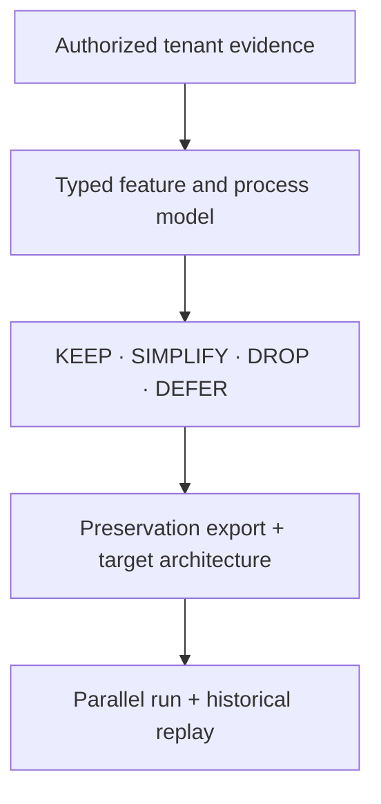

# SaaS Rebuild

[](https://github.com/chrbailey/saas-rebuild/actions/workflows/ci.yml)
[](https://github.com/chrbailey/saas-rebuild/actions/workflows/test.yml)
[](LICENSE)

> Evidence-driven system identification for software you administer.

SaaS Rebuild is an open Claude Code plugin and machine-checked protocol for
mapping what a SaaS tenant **actually does**, separating essential behavior
from purchased complexity, preserving each reachable data class or recording
an accountable gap, and deriving a smaller replacement architecture from cited
evidence and replayable behavior.

Run it yourself on software you administer, use the contracts to standardize a
consulting or migration engagement, or study the included reference rebuild as
an engineering pattern.

It does not recover a vendor's source code, bypass access controls, or promise
that every SaaS product can become a prompt. It reverse-engineers the part a
customer legitimately owns: its configuration, data, observed workflows,
integrations, operating rules, and historical input/output behavior.

That distinction is the project.

## The 60-second model

Most modernization work starts with what the old product *offers*. SaaS Rebuild
starts with what one tenant *uses* and can prove.

Day-one discovery can start from the
[extraction-recipe corpus](skills/saas-rebuild/corpus/README.md). Its target
index names 100 B2B applications; at v0.7, 29 have schema-validated recipes
covering documented export rights, routes, role/SKU gates, retention clues,
and preservation concerns. A recipe is a vendor-document-derived route
hypothesis, not proof about a tenant. Its routes must be re-verified against
current documentation, entitlements, and the live account before use.

The teardown can also emit provenance-bearing perception, judgment, replay,
and design pairs. Dataset roles are assigned by case lineage before training,
so a replay held out for acceptance cannot leak into development examples.



| Layer | Questions answered | Evidence |
|---|---|---|
| Structure | What exists or was configured? | Metadata, setup, schemas, code, roles |
| Runtime | What actually happened? | Transactions, executions, audit logs, integrations |
| Human and commercial | What matters, and what was paid for? | Interviews, workarounds, contracts, SLAs |
| Preservation | What must survive even if it is not rebuilt? | Full exports, files, history, config, checksums |
| Verification | Does the replacement preserve intended behavior? | Held-out cases, replay, expected-divergence register |

Every material conclusion carries a typed citation. Configuration alone does
not prove use. A short telemetry window does not prove non-use. A plausible
model answer does not prove equivalence.

## What “distill a SaaS” means here

“Distillation” is used in the behavioral sense: reduce an observed system to
the smallest explicit set of data contracts, rules, workflows, and interfaces
that preserve the behavior the organization still needs.

The output is not automatically a Claude skill. The protocol selects the right
runtime for each capability:

| Capability shape | Normal target |
|---|---|
| Knowledge work, analysis, document transformation | Skill plus schemas and tools |
| Deterministic calculations or file transforms | Tested library, script, or service |
| Shared transactional state, concurrency, permissions | Application, database, and auth |
| Cross-system orchestration | Workflow engine or integration service |
| Regulated or irreversible decision | Deterministic controls plus human approval |

A serious rebuild is usually hybrid. The skill may become the reasoning and
orchestration layer; it should not impersonate a ledger, identity provider, or
multi-user database.

## What is in this repository

| Component | Maturity | Purpose |
|---|---|---|
| [`saas-rebuild`](skills/saas-rebuild/SKILL.md) | Protocol / Claude Code skill | Runs the evidence, preservation, architecture, and replay workflow |
| [Extraction recipes](skills/saas-rebuild/corpus/README.md) | Document-derived route hypotheses | Seeds authorized extraction and preservation planning; tenant verification is still required |
| [Machine contracts](skills/saas-rebuild/templates) | JSON Schema 2020-12 | Constrain features, citations, paired cases, run state, graphs, and preservation manifests |
| [Technical playbooks](skills/saas-rebuild/references) | Reviewable methodology | Extraction, process mining, and dependency analysis with explicit failure conditions |
| [Synthetic worked example](examples/synthetic-crm) | Executable documentation | Shows the artifacts and cross-file lineage without tenant data |
| [Skill evals](skills/saas-rebuild/evals/evals.json) | Evaluation specification | Realistic tasks and verifiable expectations for fresh-session A/B testing |
| [`export-compliance`](skills/export-compliance/SKILL.md) | Reference implementation | Demonstrates the intended end state: deterministic core, optional model judgment, human gate, audit trail |

The `saas-rebuild` skill is an executable instruction and evidence protocol,
not a universal connector or one-click crawler. Platform APIs, permissions,
retention windows, and data models differ; the agent follows the protocol
using the authorized tools available for that tenant.

Version 0.7 changes the artifact contracts. Existing users should read the
[v0.6 → v0.7 migration guide](docs/migration-v0.7.md) rather than changing the
version field on old outputs.

## Proof surfaces

This repository deliberately separates claims from evidence:

- JSON Schemas reject evidence-free verdicts, incompatible label authorities,
  and unreviewed shareable pairs.
- Extraction recipes are schema-checked against the 100-entry research
  backlog, with HTTPS/date/uniqueness checks on each bibliography. They remain
  documented route hypotheses; v0.7 does not machine-map individual claims to
  sources or prove that a route works in a tenant.
- The cross-artifact validator rejects duplicate identities, unresolved graph
  evidence, dataset lineages crossing roles, path escapes, and digest drift; a
  synthetic teardown exercises it end-to-end in CI.
- The reference screening engine runs 274 standard-library tests across Python
  3.11–3.14, including adversarial fail-closed cases and determinism checks.
- Skill archives are built from sorted source bytes with fixed metadata; CI
  performs independent fresh builds and verifies source parity and SHA-256
  digests without storing generated binaries in source control.
- The tag workflow generates GitHub build-provenance attestations for release
  archives.
- Public claims, their enforcement surface, and residual limitations are
  listed in the [assurance case](docs/assurance-case.md).

Test count is not treated as proof of correctness. The claims table states
what each test surface does—and does not—establish.

Validate a teardown directory with the same schema and cross-file checks used
in CI:

```bash
python -m pip install --requirement requirements-dev.txt
python skills/saas-rebuild/tools/validate_artifacts.py examples/synthetic-crm
```

## Install

### Claude Code marketplace

Run these inside Claude Code:

```text
/plugin marketplace add chrbailey/saas-rebuild
/plugin install saas-rebuild@chrbailey-plugins
```

Invoke the teardown skill explicitly:

```text
/saas-rebuild:saas-rebuild Tear down the CRM tenant I administer and tell me what we actually use.
```

The bundled reference skill is available as
`/saas-rebuild:export-compliance`.

### Manual skill install

```bash
cp -R skills/saas-rebuild ~/.claude/skills/
```

For a project-scoped install, copy it to `.claude/skills/saas-rebuild/` in
that project. Review any project skill before accepting the workspace trust
prompt.

Versioned ZIPs, `SHA256SUMS`, and build-provenance attestations are published
on [GitHub Releases](https://github.com/chrbailey/saas-rebuild/releases). They
are generated from the tagged source rather than committed back into the
repository.

## What a teardown produces

The default run directory contains both machine and human artifacts:

| Artifact | Role |
|---|---|
| `teardown.json` | Resumable run state, preflight status, data boundary, and action log |
| `feature-inventory.json` | Features, usage, verdicts, and typed evidence citations |
| `inventory.md` | Human-readable surface inventory |
| `usage-analysis.md` | KEEP / SIMPLIFY / DROP / DEFER decisions and reasons |
| `graph.json` | Typed feature, process, entity, script, report, and integration graph |
| `extraction-runbook.md` | Supported route, fields, cadence, and validation for each retained entity |
| `preservation-manifest.json` | Full-tenant export inventory, file digests, gaps, and acceptance |
| `pairs.jsonl` | Provenance-bearing behavior and judgment pairs with isolated dataset roles |
| `REBUILD_PLAN.md` | Target selection, milestones, bridges, replay criteria, and cutover gates |

Verdicts control what is rebuilt; they never control what is preserved.

## Pipeline

1. **Authorize and bound the work.** Confirm tenant ownership/admin authority,
   vendor terms, data classes, model/connector boundary, retention clocks, and
   read/write scope.
2. **Inventory breadth-first.** Walk the UI and enumerate configuration,
   transaction, master-data, setup, code, report, and integration surfaces.
3. **Measure lived behavior.** Join structural evidence to runtime evidence;
   use process mining only when the event log has a defensible case notion and
   coverage window.
4. **Classify with evidence.** Assign KEEP, SIMPLIFY, DROP, or DEFER, record
   why, and retain uncertainty rather than converting missing data into zero.
5. **Preserve the full tenant.** Export every entity and attachment class,
   audit/config artifacts, identities, and replay cases; checksum the result
   and record every accepted gap.
6. **Derive the replacement.** Use the typed dependency graph to select target
   runtimes, order schemas, identify bridges, and define incremental cutover
   milestones.
7. **Verify behavior.** Hold back case lineages before any training, replay
   historical inputs against version-matched state, and separate intended
   improvements from unexplained divergence.

See [Method and intellectual lineage](docs/methodology.md) for the formal model,
failure modes, and relationship to adjacent fields.

## Data boundary and responsible use

`raw-local-only` is an **artifact distribution label**, not a claim that data
never crossed a network. A hosted model or remote browser/MCP connector can
receive whatever content it is shown. Before acquisition, record the actual
model, connector, storage, residency, retention, and approval boundary in
`teardown.json`; then minimize fields and aggregate whenever record-level data
is unnecessary.

Use this only on software and data you are authorized to administer. Prefer
official exports and APIs, respect rate limits and contractual restrictions,
never capture credentials, and require counsel when regulated data, disputed
export rights, or prohibited automated access changes the risk.

The protocol does not establish legal compliance, data completeness, or
behavioral equivalence by itself. Those are acceptance claims backed by
artifacts, tests, and accountable reviewers.

## Reference rebuild: export compliance

The second skill is a concrete example of the architecture the protocol is
trying to produce. Its restricted-party screening engine keeps fetching,
parsing, matching, legal-effect rules, exit codes, and audit integrity in
deterministic Python. Model adjudication is optional and cannot clear an exact
match; a human owns the disposition.

The deterministic/offline mode makes no outbound call after list refresh. If a
hosted adjudicator or critic is configured, screening sends a deliberately
minimized payload to that endpoint; it is therefore no longer a closed-network
run. See the [skill](skills/export-compliance/SKILL.md) for the legal and
operational limitations. It is an engineering reference, not proof that every
SaaS replacement has the same shape.

## Historical public report

[Issue #1](https://github.com/chrbailey/saas-rebuild/issues/1) is an earlier
public teardown report that predates the v0.7 contracts. Its verdict taxonomy,
evidence language, and skill-only target framing are legacy rather than
normative. The repository links to that source record for transparency but
does not republish derived engagement material as part of the v0.7 evidence
base.

## Research lineage

The project combines established ideas rather than claiming a new scientific
primitive:

- [Process Mining Manifesto](https://processmining.org/old-version/files/mao-process-mining.pdf): event-log quality, discovery, and conformance.
- [W3C PROV Data Model](https://www.w3.org/TR/prov-dm/): provenance as the basis for judging reliability and trustworthiness.
- [GUI ripping research](https://www.cs.umd.edu/~atif/pubs/WCRE2013.pdf): systematic GUI traversal and model recovery.
- [Mining Specifications](https://dl.acm.org/doi/10.1145/503272.503275): inferring candidate specifications from execution traces.
- [Oracle-guided synthesis](https://people.eecs.berkeley.edu/~sseshia/pubdir/icse10-TR.pdf): input/output examples, distinguishing cases, and finite-example limits.
- [Strangler Fig](https://martinfowler.com/bliki/StranglerFigApplication.html): incremental replacement instead of big-bang cutover.

The original contribution is the integration: tenant-level evidence,
preservation, target selection, lineage-safe paired cases, dependency-derived
sequencing, and replay acceptance in one inspectable protocol.

## Contributing and security

Read [CONTRIBUTING.md](CONTRIBUTING.md) before changing a schema, public claim,
or release artifact. [Share a sanitized teardown](https://github.com/chrbailey/saas-rebuild/issues/new?template=teardown-report.yml)
through the structured issue form. Report security issues through the process
in [SECURITY.md](SECURITY.md), not a public issue.

Licensed under the [MIT License](LICENSE).
