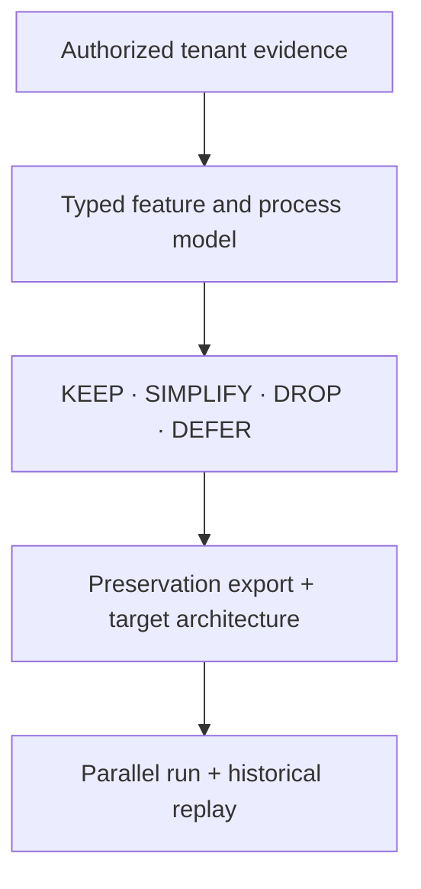

# SaaS Rebuild

[](https://github.com/chrbailey/saas-rebuild/actions/workflows/ci.yml)
[](https://github.com/chrbailey/saas-rebuild/actions/workflows/test.yml)
[](LICENSE)

> **Prove what your SaaS actually does. Keep every byte of your data. Rebuild only the part you need.**

Most companies pay for 100% of a SaaS or ERP product, use a fraction of it,
and cannot say which fraction. Renewals get signed on the vendor's adoption
deck and a gut feeling. Migrations start the data export *after* the contract
decision, which is exactly backwards, and the attachments, audit trail, and
configuration that explain the data are the first things lost.

SaaS Rebuild is a free, open-source protocol that fixes the order of
operations. Point it at a tenant you administer and it produces an
**evidence-cited verdict for every feature** (KEEP / SIMPLIFY / DROP / DEFER),
a **checksummed export of everything you can reach** whether or not you keep
it, and a **replacement plan validated by replaying your own history**, not by
a vendor demo. It runs as a Claude Code plugin or in a browser workspace with
your own API key, and it ships with documented export routes for 29 of the
most common B2B applications.

**Who it is for**

- **IT and ops admins facing a renewal or true-up.** Walk in with a feature-by-feature
  usage table where every row cites the log, export, or contract line that
  supports it, instead of arguing with a dashboard the vendor built.
- **Teams leaving NetSuite, Salesforce, QuickBooks, HubSpot, Microsoft 365, or two dozen others.**
  Start from a written inventory of every export route, retention clock, and
  role gate, and rehearse the export while the contract is still healthy.
- **Consultants and MSPs.** Turn the SaaS-rationalization engagement into a
  repeatable, machine-checked deliverable with a standard artifact set.
- **Builders replacing a bloated tool with something smaller.** Get a
  dependency-ordered rebuild plan and a regression corpus drawn from real
  historical behavior.

The whole thing is deliberately honest about its limits. It reverse-engineers
the part a customer legitimately owns (configuration, data, observed
workflows, integrations, operating rules, historical inputs and outputs). It
does not touch vendor source code, bypass access controls, or promise that
every SaaS product can become a prompt. The schemas reject a verdict with no
evidence behind it, and a 30-day quiet log is never allowed to prove a
year-end feature is unused. That discipline is the product.

## Five-minute quickstart (no tenant required)

Pick whichever door fits. None of them touches a live account.

**Door 1 — the browser workspace, nothing to install.** The
[`web/`](web/README.md) directory is a static app that runs the full protocol
in your browser, guided by Claude, using your own Anthropic API key (stored
only in your browser, sent only to Anthropic). It emits every artifact below as
a downloadable file and lets you browse or attach any of the 29 extraction
recipes. Serve it locally with one command:

```bash
cd web && python3 -m http.server 8080   # then open http://localhost:8080
```

A hosted copy of the same workspace runs at [saas-rebuild-workspace.vercel.app](https://saas-rebuild-workspace.vercel.app), deployed automatically from `main` on Vercel.

**Door 2 — the Claude Code plugin.** Inside Claude Code:

```text
/plugin marketplace add chrbailey/saas-rebuild
/plugin install saas-rebuild@chrbailey-plugins
```

That adds two slash commands: `/saas-rebuild:saas-rebuild` (the teardown
protocol) and `/saas-rebuild:export-compliance` (the reference rebuild).

**Door 3 — see the machine checks bite.** From a clone of this repository, run
the same validator CI runs against the fictional worked example:

```bash
python -m pip install --requirement requirements-dev.txt
python skills/saas-rebuild/tools/validate_artifacts.py examples/synthetic-crm
```

Expected output:

```text
artifact validation passed (4 features, 4 pairs)
```

That one line means every artifact passed its JSON Schema and the cross-file
checks schemas cannot express: evidence ids resolve, graph edges land on real
nodes, dataset lineages never cross roles, and every preserved file has the
byte size and SHA-256 digest its manifest claims. Change one digit of a digest
in `preservation-manifest.json` and the command exits non-zero. Then read the
verdicts it produced in
[`examples/synthetic-crm/usage-analysis.md`](examples/synthetic-crm/usage-analysis.md);
a test fails if that Markdown ever drifts from the JSON it is rendered from.

**Then, on a tenant you administer:**

```text
/saas-rebuild:saas-rebuild Tear down the CRM tenant I administer and tell me what we actually use.
```

If the application is one of the
[29 covered applications](skills/saas-rebuild/corpus/README.md#covered-applications),
the skill starts from that recipe's documented export routes. Every route is a
hypothesis to verify in your tenant, not a promise.

### Manual skill install

```bash
cp -R skills/saas-rebuild ~/.claude/skills/
```

For a project-scoped install, copy it to `.claude/skills/saas-rebuild/` in
that project. Review any project skill before accepting the workspace trust
prompt.

Versioned ZIPs, `SHA256SUMS`, and build-provenance attestations are published
on [GitHub Releases](https://github.com/chrbailey/saas-rebuild/releases). They
are generated from the tagged source rather than committed back into the
repository.

## What a teardown produces

You walk away with a folder that answers the three questions a renewal, a
migration, or a rebuild actually turns on: *what do we use*, *what must we
keep*, and *what would replace it*. Half of it is for machines and half for
the people who have to sign off:

| Artifact | Role |
|---|---|
| `teardown.json` | Resumable run state, preflight status, data boundary, and action log |
| `feature-inventory.json` | Features, usage, verdicts, and typed evidence citations |
| `inventory.md` | Human-readable surface inventory |
| `usage-analysis.md` | KEEP / SIMPLIFY / DROP / DEFER decisions and reasons |
| `graph.json` | Typed feature, process, entity, script, report, and integration graph |
| `extraction-runbook.md` | Supported route, fields, cadence, and validation for each retained entity |
| `preservation-manifest.json` | Full-tenant export inventory, file digests, gaps, and acceptance |
| `pairs.jsonl` | Provenance-bearing behavior and judgment pairs with isolated dataset roles |
| `REBUILD_PLAN.md` | Target selection, milestones, bridges, replay criteria, and cutover gates |

Verdicts control what is rebuilt; they never control what is preserved.

Here is what a verdict table looks like, copied from the
[synthetic worked example](examples/synthetic-crm)'s `usage-analysis.md`.
Each row cites evidence ids that resolve to typed citations with a coverage
horizon; the example was built so that all four verdicts appear and so that
the DROP and the DEFER differ only in how far the evidence reaches:

| Feature | Verdict | Why | Evidence |
|---|---|---|---|
| `customer-search` | KEEP | Observed daily lookup is required to service customers; retain the behavior behind a smaller search contract. | `ev-search-runtime`, `ev-search-criticality` |
| `bulk-customer-import` | SIMPLIFY | Keep weekly CSV ingestion but replace flexible mappings with a versioned template and deterministic validation. | `ev-import-runtime` |
| `social-enrichment` | DROP | The disabled connector has zero executions across the complete synthetic history and supports no identified process. | `ev-enrich-config`, `ev-enrich-runtime` |
| `annual-tax-certificate` | DEFER | The short window cannot establish non-use for an annual obligation; obtain year-end evidence before selecting the target. | `ev-tax-window`, `ev-tax-contract` |

`ev-enrich-runtime` has `all-time` coverage, so zero executions can support a
DROP. `ev-tax-window` covers 60 days that exclude year end, so zero runs
cannot demote an annual obligation, and the feature is DEFER with usage
`unknown`. That asymmetry is the rule the schemas enforce: configuration
alone does not prove use, and a short window does not prove non-use.

## Every documented way to get your data out of 29 B2B apps

Even if you never run a teardown, the
[extraction-recipe corpus](skills/saas-rebuild/corpus/README.md) is worth a
bookmark. For each application it records what the vendor's own terms say you
may export, every documented extraction route in preference order (bulk
export, API, report builder, file storage, audit log, configuration export),
the roles and SKUs that gate each route, rate limits, retention clues, and
where attachments and audit history hide. Every claim carries a cited, dated
source.

Covered today (accounting, ERP, CRM, HR and payroll, spend, payments,
productivity, recruiting, and project management):

Asana · BambooHR · BILL · Brex · Deel · Dynamics 365 Business Central ·
Dynamics 365 Sales · Expensify · FreshBooks · Freshsales · Google Workspace ·
Greenhouse · HubSpot · Microsoft 365 · Microsoft Teams · NetSuite · Paylocity ·
Pipedrive · QuickBooks Online · Ramp · Sage Intacct · Salesforce ·
SAP Business One · SAP Concur · Square · Stripe · Xero · Zoho Books · Zoho CRM

The target index names 100 applications; at v0.8, 29 have schema-validated
recipes, listed in the
[covered applications](skills/saas-rebuild/corpus/README.md#covered-applications)
table. Every recipe is marked `doc-derived-unverified`: researched from
vendor documentation, never yet exercised against a live account. If you
administer one of these applications, the single most valuable hour you can
give this project is to try the documented routes against reality and
[file what matched and what did not](https://github.com/chrbailey/saas-rebuild/issues/new?template=recipe-verification.yml).
The schema has `community-verified` and `tenant-verified` statuses waiting to
be earned.

## The 60-second model

Most modernization work starts from what the old product *offers*. SaaS
Rebuild starts from what one tenant *uses* and can prove.



Evidence is gathered in five layers, and each conclusion says which layer it
rests on:

| Layer | Questions answered | Evidence |
|---|---|---|
| Structure | What exists or was configured? | Metadata, setup, schemas, code, roles |
| Runtime | What actually happened? | Transactions, executions, audit logs, integrations |
| Human and commercial | What matters, and what was paid for? | Interviews, workarounds, contracts, SLAs |
| Preservation | What must survive even if it is not rebuilt? | Full exports, files, history, config, checksums |
| Verification | Does the replacement preserve intended behavior? | Held-out cases, replay, expected-divergence register |

Three rules do most of the work. Configuration alone does not prove use. A
short telemetry window does not prove non-use. A plausible model answer does
not prove equivalence.

**Where each capability should go.** "Distill a SaaS" is meant behaviorally:
reduce an observed system to the smallest explicit set of data contracts,
rules, workflows, and interfaces that preserve the behavior the organization
still needs. The output is not automatically a Claude skill. The protocol
selects the right runtime for each capability:

| Capability shape | Normal target |
|---|---|
| Knowledge work, analysis, document transformation | Skill plus schemas and tools |
| Deterministic calculations or file transforms | Tested library, script, or service |
| Shared transactional state, concurrency, permissions | Application, database, and auth |
| Cross-system orchestration | Workflow engine or integration service |
| Regulated or irreversible decision | Deterministic controls plus human approval |

A serious rebuild is usually hybrid. The skill may become the reasoning and
orchestration layer; it should not impersonate a ledger, identity provider, or
multi-user database.

The teardown can also emit provenance-bearing perception, judgment, replay,
and design pairs. Dataset roles are assigned by case lineage before training,
so a replay held out for acceptance cannot leak into development examples.

## Pipeline

1. **Authorize and bound the work.** Confirm tenant ownership or admin
   authority, vendor terms, data classes, model and connector boundary,
   retention clocks, and read/write scope.
2. **Inventory breadth-first.** Walk the UI and enumerate configuration,
   transaction, master-data, setup, code, report, and integration surfaces.
3. **Measure lived behavior.** Join structural evidence to runtime evidence;
   use process mining only when the event log has a defensible case notion and
   coverage window.
4. **Classify with evidence.** Assign KEEP, SIMPLIFY, DROP, or DEFER, record
   why, and retain uncertainty rather than converting missing data into zero.
5. **Preserve the full tenant.** Export every entity and attachment class,
   audit and config artifacts, identities, and replay cases; checksum the
   result and record every accepted gap.
6. **Derive the replacement.** Use the typed dependency graph to select target
   runtimes, order schemas, identify bridges, and define incremental cutover
   milestones.
7. **Verify behavior.** Hold back case lineages before any training, replay
   historical inputs against version-matched state, and separate intended
   improvements from unexplained divergence.

See [Method and intellectual lineage](docs/methodology.md) for the formal
model, failure modes, and relationship to adjacent fields.

## Proof surfaces

"Evidence-driven" is easy to say. This repository makes it checkable by
separating claims from their enforcement:

- JSON Schemas reject evidence-free verdicts, incompatible label authorities,
  and unreviewed shareable pairs.
- Extraction recipes are schema-checked against the 100-entry research
  backlog, with HTTPS, date, and uniqueness checks on each bibliography, and a
  test keeps research-session caveats in their own `research_caveats` field
  rather than in reader-facing prose. They remain documented route hypotheses;
  v0.8 does not machine-map individual claims to sources or prove that a route
  works in a tenant.
- The cross-artifact validator rejects duplicate identities, unresolved graph
  evidence, dataset lineages crossing roles, path escapes, and digest drift; a
  synthetic teardown exercises it end-to-end in CI, and the Markdown rendered
  from that teardown is tested against its JSON.
- The reference screening engine runs 379 standard-library tests across Python
  3.11 to 3.14, including adversarial fail-closed cases and determinism checks.
- Skill archives are built from sorted source bytes with fixed metadata; CI
  performs independent fresh builds and verifies source parity and SHA-256
  digests without storing generated binaries in source control.
- The tag workflow generates GitHub build-provenance attestations for release
  archives.
- Public claims, their enforcement surface, and residual limitations are
  listed in the [assurance case](docs/assurance-case.md).

Test count is not treated as proof of correctness. The claims table states
what each test surface does, and does not, establish.

## What is in this repository

| Component | Maturity | Purpose |
|---|---|---|
| [`saas-rebuild`](skills/saas-rebuild/SKILL.md) | Protocol / Claude Code skill | Runs the evidence, preservation, architecture, and replay workflow |
| [Browser workspace](web/README.md) | Static app, bring your own key | Runs the same protocol from a browser with no install; emits artifacts as downloads |
| [Extraction recipes](skills/saas-rebuild/corpus/README.md) | Document-derived route hypotheses | Seeds authorized extraction and preservation planning; tenant verification is still required |
| [Machine contracts](skills/saas-rebuild/templates) | JSON Schema 2020-12 | Constrain features, citations, paired cases, run state, graphs, and preservation manifests |
| [Technical playbooks](skills/saas-rebuild/references) | Reviewable methodology | Extraction, process mining, and dependency analysis with explicit failure conditions |
| [Synthetic worked example](examples/synthetic-crm) | Executable documentation | Shows the artifacts and cross-file lineage without tenant data |
| [Skill evals](skills/saas-rebuild/evals/evals.json) | Evaluation specification | Realistic tasks and verifiable expectations for fresh-session A/B testing |
| [`export-compliance`](skills/export-compliance/SKILL.md) | Reference implementation | Demonstrates the intended end state: deterministic core, optional model judgment, human gate, audit trail |

The `saas-rebuild` skill is an executable instruction and evidence protocol,
not a universal connector or one-click crawler. Platform APIs, permissions,
retention windows, and data models differ; the agent follows the protocol
using the authorized tools available for that tenant.

Version 0.8 tightens the artifact contracts again. Existing users should read
the [v0.7 → v0.8 migration guide](docs/migration-v0.8.md) (and, for older
outputs, the [v0.6 → v0.7 migration guide](docs/migration-v0.7.md)) rather
than changing the version field on old outputs.

## Reference rebuild: export compliance

The second skill shows what the protocol is trying to produce at the end of a
rebuild. Its restricted-party screening engine keeps fetching, parsing,
matching, legal-effect rules, exit codes, and audit integrity in
deterministic Python. Model adjudication is optional and cannot clear an exact
match; a human owns the disposition.

The deterministic offline mode makes no outbound call after list refresh. If a
hosted adjudicator or critic is configured, screening sends a deliberately
minimized payload to that endpoint; it is therefore no longer a closed-network
run. See the [skill](skills/export-compliance/SKILL.md) for the legal and
operational limitations. It is an engineering reference, not proof that every
SaaS replacement has the same shape.

## Data boundary and responsible use

Use this only on software and data you are authorized to administer. Prefer
official exports and APIs, respect rate limits and contractual restrictions,
never capture credentials, and require counsel when regulated data, disputed
export rights, or prohibited automated access changes the risk.

`raw-local-only` is an **artifact distribution label**, not a claim that data
never crossed a network. A hosted model or remote browser or MCP connector can
receive whatever content it is shown. Before acquisition, record the actual
model, connector, storage, residency, retention, and approval boundary in
`teardown.json`; then minimize fields and aggregate whenever record-level data
is unnecessary.

The protocol does not establish legal compliance, data completeness, or
behavioral equivalence by itself. Those are acceptance claims backed by
artifacts, tests, and accountable reviewers.

## Historical public report

[Issue #1](https://github.com/chrbailey/saas-rebuild/issues/1) is an earlier
public teardown report that predates the v0.7 contracts. Its verdict taxonomy,
evidence language, and skill-only target framing are legacy rather than
normative. The repository links to that source record for transparency but
does not republish derived engagement material as part of the v0.8 evidence
base.

## Research lineage

The project combines established ideas rather than claiming a new scientific
primitive:

- [Process Mining Manifesto](https://processmining.org/old-version/files/mao-process-mining.pdf): event-log quality, discovery, and conformance.
- [W3C PROV Data Model](https://www.w3.org/TR/prov-dm/): provenance as the basis for judging reliability and trustworthiness.
- [GUI ripping research](https://www.cs.umd.edu/~atif/pubs/WCRE2013.pdf): systematic GUI traversal and model recovery.
- [Mining Specifications](https://dl.acm.org/doi/10.1145/503272.503275): inferring candidate specifications from execution traces.
- [Oracle-guided synthesis](https://people.eecs.berkeley.edu/~sseshia/pubdir/icse10-TR.pdf): input/output examples, distinguishing cases, and finite-example limits.
- [Strangler Fig](https://martinfowler.com/bliki/StranglerFigApplication.html): incremental replacement instead of big-bang cutover.

The original contribution is the integration: tenant-level evidence,
preservation, target selection, lineage-safe paired cases, dependency-derived
sequencing, and replay acceptance in one inspectable protocol.

## Contributing and security

The fastest ways to help need no code. If you ran a teardown, even a partial
one, [share a sanitized teardown report](https://github.com/chrbailey/saas-rebuild/issues/new?template=teardown-report.yml);
the "what this skill missed" section is where the protocol improves. If you
administer one of the 29 covered applications,
[verify an extraction recipe](https://github.com/chrbailey/saas-rebuild/issues/new?template=recipe-verification.yml)
against your tenant; the corpus stays `doc-derived-unverified` until people
who run these applications confirm or correct it. Read
[CONTRIBUTING.md](CONTRIBUTING.md) before changing a schema, public claim, or
release artifact, and report security issues through the process in
[SECURITY.md](SECURITY.md), not a public issue.

Licensed under the [MIT License](LICENSE).
